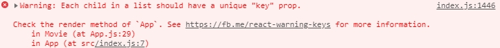

# #2 & #3

2019.02.20

## 프로젝트 시작시 하는 일

- Component 디자인
  - 내가 만들어야 하는 Component 에 대한 구분
  - 각각의 기능, 사이즈 등을 정리
  - 여기서는 Movie_app 에 필요한 Component 를 정리함
    - List Component
      - 전체 리스트 출력될 부분
      - Movie Component 가 내용으로 담김
    - Movie Component
      - 개별 영화 정보 담기
      - 제목, 내용, 평점 등
    - Poster Component
      - 개별 영화의 포스터 담기

- 가장 큰 Component를 APP.js 부분에 담음

## TIP

- VScode 에서 ReactJS 파일 저장시 포멧이 깨질 경우
  - Ctrl + K M 을 누르면 포멧언어 변경 가능
  - javascript react 로 변경하면 저장하면 됨

## JSX

- React Component 를 만들 때 사용하는 언어

---

- 각각의 컴포넌트에 각각 function 이 있음
- 모든 컴포넌트에는 render function 이 있음
- render 부분이 view 부분이라 생각하면 됨
- public\index.html 에 html 파일이 있음
- index.html - index.js - app.js 형태로 연결되어 있음
- react : UI 라이브러리
- reactDOM: React 를 웹사이트로 출력(render) 해주는 기능
- reactNative: React 를 모바일 앱으로 출력해주는 기능

- Component needs render, return, JSX
- JSX 의 경우 꼭 중괄호를 써야지 데이터에 접근 가능함

## Props

- 부모 Component 에서 자식 Component 로 데이터를 전달할 때 사용
- props 가 Object 형태로 전달됨
- Main Component 가 모든 Data 를 가지고 있고, 자식에게 Props 로 전달해서 사용 가능함

---

## JS Map

- ForEach 와 비슷한 행동을 하는 함수
- return 값을 밖으로 보낼 수 있음 (foreach 는 불가능함)
- [http://blog.kazikai.net/?p=16](http://blog.kazikai.net/?p=16)

---

## Key Warning

- 위 맵 함수를 쓸때 주의해야 할 점
- ReactJS 에서는 List 를 보낼 때 Key 값이 있어야 한다고 권고함
- 따라서 Props 를 보낼때 Key 값을 같이 보내면 됨

## Prop-types

- [https://medium.com/@sangboaklee/react-proptypes-%ED%99%9C%EC%9A%A9%ED%95%98%EA%B8%B0-7a0615da236](https://medium.com/@sangboaklee/react-proptypes-%ED%99%9C%EC%9A%A9%ED%95%98%EA%B8%B0-7a0615da236)
- 타입 체크 + 문서화와 가독성 개선

## Component Lifecycle

- 컴포넌트는 여러 기능들을 정해진 순서대로 실행함
  

- 추후 변경 예정인 사항이 있음